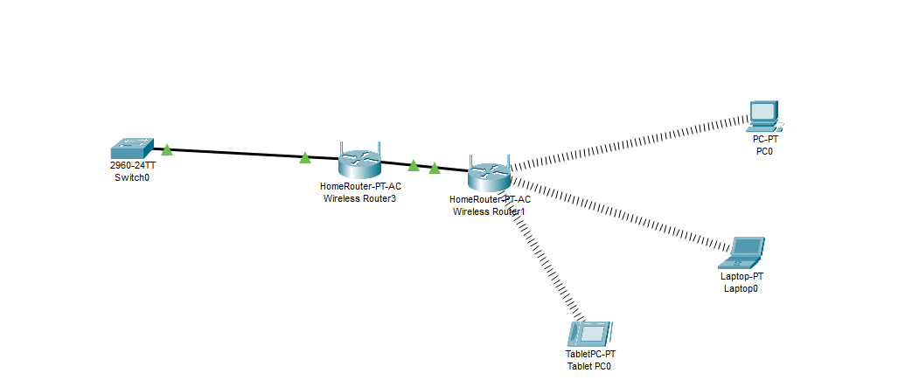

# Laboratorio de redes 1 

<code>Laboratorio 1 de redes 2</code>

Realizado <code>Jeison Daneiro Montenegro Cuasialpud</code>

  
  
  
 ## 2. [Preguntas de conocimiento](#) ✔ 
  
 <ol type="a"> 
 <li>¿Cual es la dirección de red y de broadcast de un host que tiene una ip 192.168.10.10/30 .?</li> 

   Ip = 192.168.10.10/30 
   
   Dirección de Red = 192.168.10.8/30

   Direccion de Broadcast = 192.168.10.11

   Host Minimo = 192.168.10.9

   Host Maximo= 192.168.10.10

 <li>¿Cuantos clientes puede tener la sub red 172.16.0.0/22?.</li> 
 <li>¿Que clase y tipo de dirección es 10.10.10.0/24?.</li>

   Es de clase A y es de tipo Privada
 <li>¿Que información se puede inferir de la dirección 169.254.255.200/26?.</li> 

   Se puede inferir que es de clase B porque su primer octeto esta en el rango de 128 a 191 y es de tipo publica
 </ol> 
  
 ## 3. [Caracterización de los adaptadores](#) ✔ 
 |Parámetro||Valor| 
 |--|:--:|--:| 
 |Número de adaptadores Físicos|-->|3| 
 |Número de adaptadores Virtuales|-->|1| 
 |Tipo de Adaptador principal|-->|Ethernet| 
 |Fabricante del Adaptador principal|-->|Realke PCle Family Controller| 
 |Código MAC del fabricante|-->|| 
 |MAC|-->|1C-BF-C0-35-CF-C6| 
  
 
  
  
 ## 4. [Caracterización de la red](#) ✔ 
 |Parámetro|Valor| 
 |--|--:| 
 |_Subnet_|| 
 |IPv4|192.168.1.43| 
 |Subnet Mask decimal|24| 
 |Subnet Mask octetos|255.255.255.0| 
 |Número de direcciones de Host|254| 
 |Rango de direcciones de Host|108.177.13.188| 
 |IP Broadcast|192.168.1.255| 
 |Server DHCP|192.168.1.1| 
 |Server DNS|8.20.247.20| 
  
 
  
  
 ## 5. [Caracterización de la puerta de enlace](#) ✔ 
 |Parámetro|Valor| 
 |--|--:| 
 |Número de Entradas en la tabla ARP |8| 
 |IPv4 Gateway|26.0.0.1| 
 |MAC Gateway|| 
 |ISP|Sistemas palacios| 
 |[IP Publica][5]|8.242.185.2| 
 |Sistema Autónomo|| 
  
  
 
  
  
 ## 6. [Retardo de la red](#) ✔ 
 |Servidor|IP|Tiempo promedio/ms| 
 |--|--|--| 
 |DNS Google|8.8.8.8|11ms| 
 |DNS Cloudflare|1.1.1.1|78ms| 
 |OpenDNS|208.67.222.222|95 ms| 
 |Alternate DNS|208.67.220.220|113 ms| 
 |DNS Quad9|9.9.9.9|125 ms| 
 |AdGuard DNS|94.140.14.14|80 ms| 
  
 
  
  
 ## 7. [Capacidad del canal](#) ✔ 
 |Servidor|Ping/ms|Down/MB|Up/MB| 
 |--|:--:|--:|--:| 
 |[speed test][1]|Tiempo de Espera Agotado para Esta Solicitud|9 Mbps|6 Mbps| 
 |[Netflix][2]|Tiempo de Espera Agotado para Esta Solicitud|20 Mb|40 Mb| 
 |[Claro][3]|Tiempo de Espera Agotado para Esta Solicitud|13.4 Mbps|13.9 Mbps| 
 |[nperf][4]|164 ms|14.27 Mb/s|13.41 Mb/s| 
  
  
  
  
 ## 8. [Distancia desde el host](#) ✔ 
 |Servidor|Ping/ms|Numero de Saltos| 
 |--|:--:|--:| 
 |google.com|144 ms|10| 
 |GMail.com|83 ms|9| 
 |YouTube.com|102 ms|11| 
 |dns.google|73 ms|12| 
 |aws.amazon.com|32 ms|20| 
 |portal.azure.com|156 ms|28| 
 |login.live.com|209 ms|23| 
 |Facebook.com|414 ms|13| 
 |c.ns.WhatsApp.net|1478 ms|2| 
 |claro.com.co|Tiempo de espera agotado para esta solicitud|3| 
 |platzi.com|933 ms|No se puede resolver el nombre del sistema de destino Platzi.com.| 
 |rappi.com.co|Tiempo de espera agotado para esta solicitud|2| 
  
  
  
 ## 9. [Diagrama de Red](#) ✔ 
 - Realice un diagrama topológico de la red que le ofrece conectividad a internet. 
 
  Diagrama.
 
 - Incluya todos los detalles de la red de area local a la que se encuentra conectado. 
 1. De la nat se conecta directamente a la olt que distribuye la conexion a internet.
 2. Tenemos una red en dos inicialmente secundaria en la casa administrada por un Router Tp-link (TL-WR940N), con el cual abarca una mayor amplitud para la señal.
 3. Tenemos un router el cual es de la empresa que es un router G-Pon el cual da aceso de red a internet y se conecta a la nat del poste por medio de fibra-optica.
 - Incluya los saltos conocidos incluyendo el equipo de borde de su ISP. 
  
 ## 10. [Preguntas de conocimiento](#) ✔ 
 1. Cual es la dirección de red y de broadcast de un host que tiene una ip 192.168.10.10/30. 
 1. Cuantos equipos o. 
 1. Incluya los saltos conocidos incluyendo el equipo de borde de su ISP.